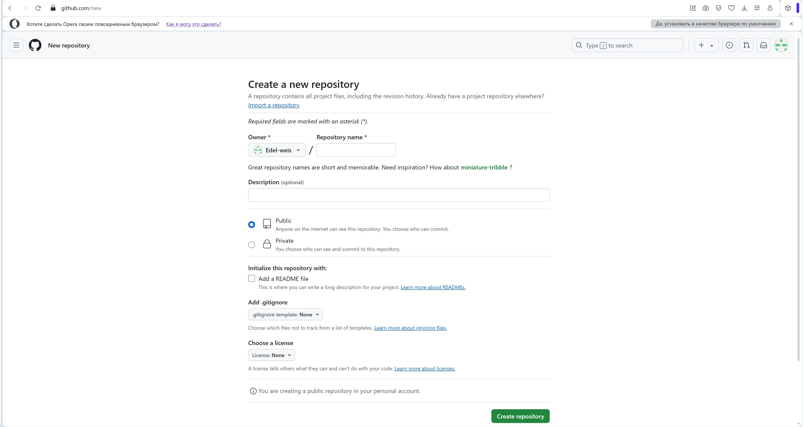
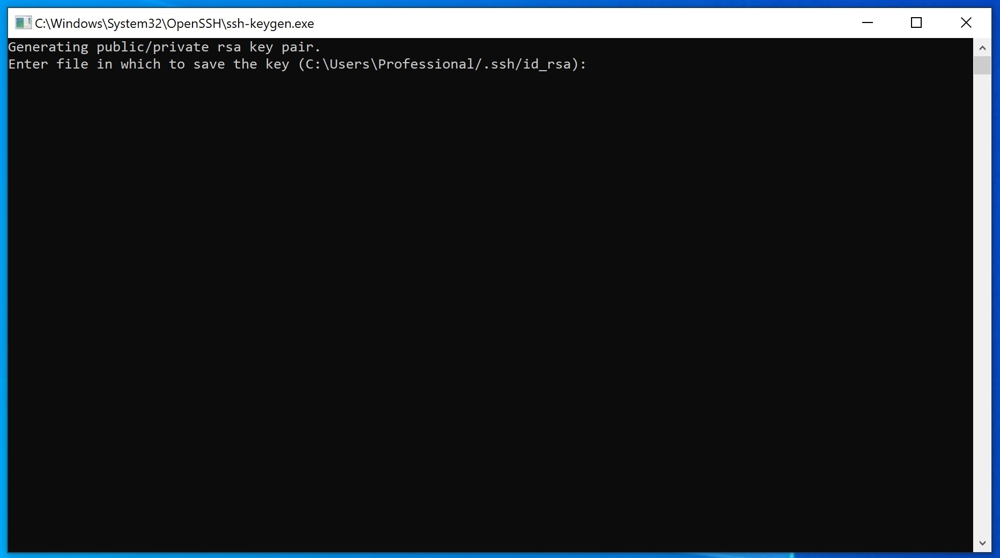
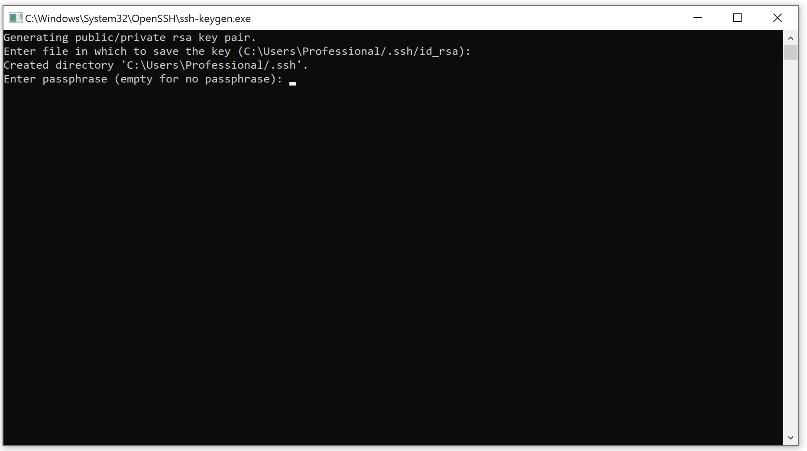
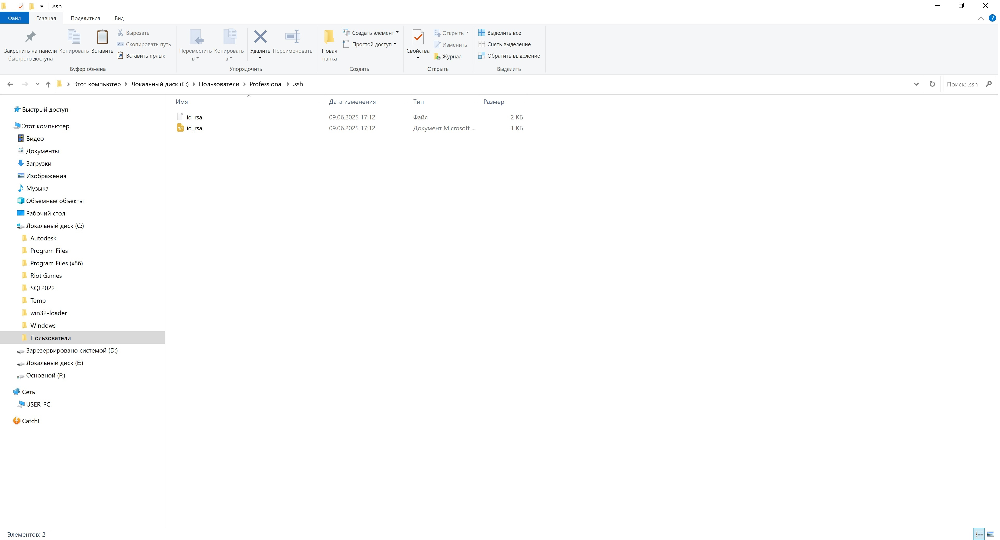
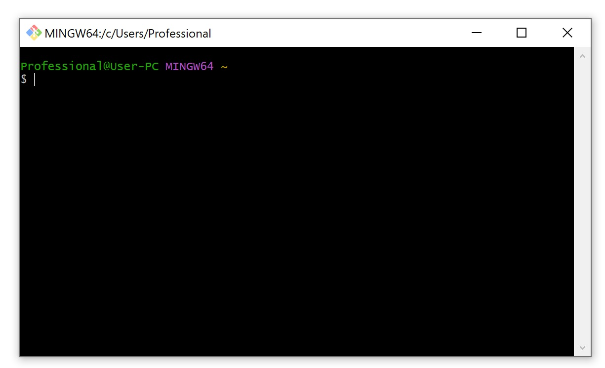
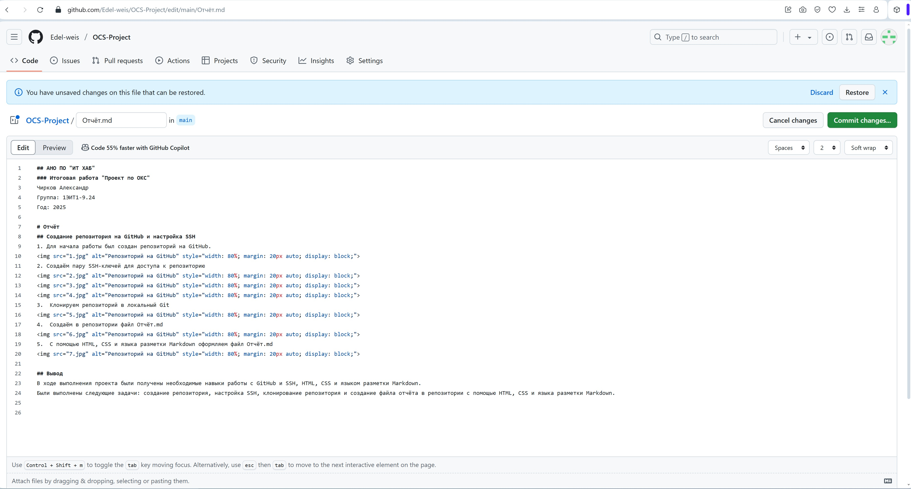
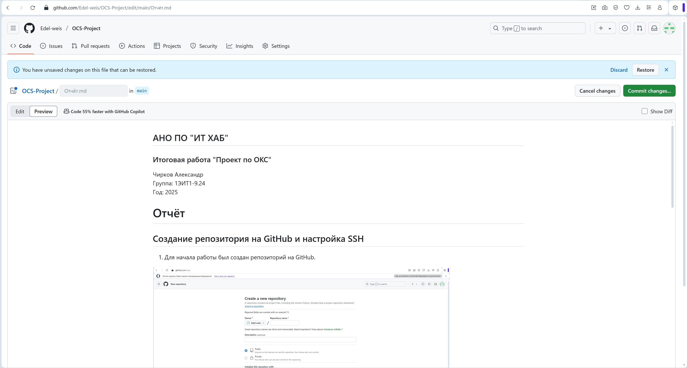

## АНО ПО "ИТ ХАБ"
### Итоговая работа "Проект по ОКС"
Чирков Александр  
Группа: 1ЭИТ1-9.24  
Год: 2025

# Отчёт
## Создание репозитория на GitHub и настройка SSH
1. Для начала работы был создан репозиторий на GitHub.

2. Создаём пару SSH-ключей для доступа к репозиторию

3.  Клонируем репозиторий в локальный Git

4.	Создаём в репозитории файл Отчёт.md

5.	С помощью HTML, CSS и языка разметки Markdown оформляем файл Отчёт.md

## Вывод
В ходе выполнения проекта были получены необходимые навыки работы с GitHub и SSH, HTML, CSS и языком разметки Markdown.
Были выполнены следующие задачи: создание репозитория, настройка SSH, клонирование репозитория и создание файла отчёта в репозитории с помощью HTML, CSS и языка разметки Markdown.

